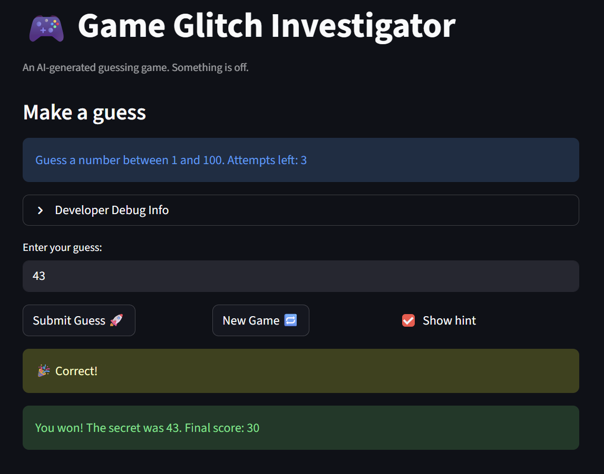

# 🎮 Game Glitch Investigator: The Impossible Guesser

## 🚨 The Situation

You asked an AI to build a simple "Number Guessing Game" using Streamlit.
It wrote the code, ran away, and now the game is unplayable. 

- You can't win.
- The hints lie to you.
- The secret number seems to have commitment issues.

## 🛠️ Setup

1. Install dependencies: `pip install -r requirements.txt`
2. Run the broken app: `python -m streamlit run app.py`

## 🕵️‍♂️ Your Mission

1. **Play the game.** Open the "Developer Debug Info" tab in the app to see the secret number. Try to win.
2. **Find the State Bug.** Why does the secret number change every time you click "Submit"? Ask ChatGPT: *"How do I keep a variable from resetting in Streamlit when I click a button?"*
3. **Fix the Logic.** The hints ("Higher/Lower") are wrong. Fix them.
4. **Refactor & Test.** - Move the logic into `logic_utils.py`.
   - Run `pytest` in your terminal.
   - Keep fixing until all tests pass!

## 📝 Document Your Experience

- [ ] Describe the game's purpose.

The "Number Guessing Game" is a Streamlit-based application where players try to identify a hidden number within a set range. It tracks the player's accuracy and speed, calculating a final score based on how many attempts it takes to find the correct answer.

- [ ] Detail which bugs you found.

The most critical bug was that the high/low hints were completely reversed, making it impossible to follow the game's feedback. I also discovered that "Hard" mode was accidentally easier than "Normal" mode and that the scoring system gave out free points for incorrect guesses.

- [ ] Explain what fixes you applied.

I refactored the entire project to move the game rules into a separate logic_utils.py file for better organization. I then corrected the hint logic, expanded the "Hard" range to 1-500, and used pytest to verify that all scoring exploits were fully removed.

## 📸 Demo

- [ ] [Insert a screenshot of your fixed, winning game here]

## 🚀 Stretch Features

- [ ] [If you choose to complete Challenge 4, insert a screenshot of your Enhanced Game UI here]
